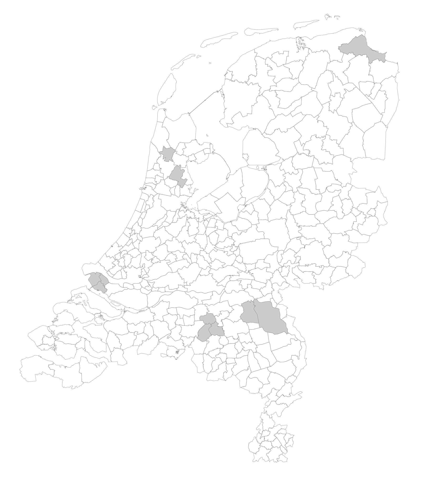

NL Election Maps (unofficial)
---

Municipality redivision elections in The Netherlands are always held before the redivision takes place.
New maps are published by the Kadaster (Dutch Cadaster) &amp; <abbr title="Centraal Bureau voor Statistiek">CBS</abbr> (Dutch Statistical Office) after the redivision [as open data](https://www.pdok.nl/-/cbs-gebiedsindelingen-geactualiseerd).

De Kiesraad (Dutch Electoral Council, an Electoral Management Body), needs to create these maps for the [election result website](https://www.verkiezingsuitslagen.nl/).

## Tools
- [curl](https://curl.se/)
- [jq](https://stedolan.github.io/jq/)
- [gdal](https://gdal.org/) ogr2ogr

Note: this generates GeoJSON and <abbr title="Scalable Vector Graphics">SVG</abbr>.
TopoJSON would compress this even better, since almost all paths are stored in two seperate polygons in the GeoJSON variant. However our use cases only use GeoJSON and SVG.

## The procedure
1. Download latest generalized municipality boundaries from CBS (in RDnew and <abbr title="World Geodetic System (WGS84)">WGS84</abbr> for testing / previewing results in tools like [geojson.io](https://geojson.io/)).
2. Find out which municipalities need merging.
3. Update municipality names in GeoJSON to the new names.
4. PostGIS Union municipalities with the same name and codes.
5. Fix the regiocode, floor to shave some bytes and remove name and wrong total. The sample rounds WGS84 to 4 decimals, [about 10 meters](https://wiki.openstreetmap.org/wiki/Precision_of_coordinates#Precision_of_latitudes), RDnew is more byte efficient because it doesn't have the decimal symbol and can have less than 6-7 chars.
6. Create a SVG for fun.

### Municipality Elections 2022 + Redivision Amsterdam (GR2022)

```bash
# 1:
curl -o cbs2022_march_wgs84.geo.json 'https://geodata.nationaalgeoregister.nl/cbsgebiedsindelingen/wfs?request=GetFeature&service=WFS&version=2.0.0&typeName=cbs_gemeente_2022_gegeneraliseerd&srsName=EPSG:4326&outputFormat=json'
curl -o cbs2022_march_rdnew.geo.json 'https://geodata.nationaalgeoregister.nl/cbsgebiedsindelingen/wfs?request=GetFeature&service=WFS&version=2.0.0&typeName=cbs_gemeente_2022_gegeneraliseerd&outputFormat=json'

# 2:
jq '.features|map(.properties|{name:.statnaam,code:.statcode}|select([.name]|inside(["Weesp"]))|{(.name):"Amsterdam",(.code):"GM0363"})|add' cbs2022_march_rdnew.geo.json -c > field-replace.json

# 3:
jq '.features=(.features|map(.properties|={name:($l[0][.statnaam] // .statnaam),code:($l[0][.statcode] // .statcode)}|.id|=empty|.geometry_name|=empty))' cbs2022_march_wgs84.geo.json --slurpfile l field-replace.json -c > cbs2022_march_wgs84_pre_union.geo.json
jq '.features=(.features|map(.properties|={name:($l[0][.statnaam] // .statnaam),code:($l[0][.statcode] // .statcode)}|.id|=empty|.geometry_name|=empty))' cbs2022_march_rdnew.geo.json --slurpfile l field-replace.json -c > cbs2022_march_rdnew_pre_union.geo.json

# 4:
ogr2ogr -sql 'SELECT name, code, ST_UNION(c.geometry) FROM "cbs2022_march_wgs84_pre_union.geo" c GROUP BY name, code;' -dialect SQLITE cbs2022_april_wgs84.geo.json cbs2022_march_wgs84_pre_union.geo.json
ogr2ogr -sql 'SELECT name, code, ST_UNION(c.geometry) FROM "cbs2022_march_rdnew_pre_union.geo" c GROUP BY name, code;' -dialect SQLITE cbs2022_april_rdnew.geo.json cbs2022_march_rdnew_pre_union.geo.json

# 5:
jq '.features=(.features|map(.properties|={name,regiocode:"G\(.code[2:])"}|.id|=empty|.geometry.coordinates|=map_values(map_values(map_values(if type == "array" then map_values(floor) else floor end)))))|.name|=empty|.totalFeatures|=empty' cbs2022_april_rdnew.geo.json -c > cbs2022_april.min.geo.json
jq 'def round(d):.*pow(10;d)|floor/pow(10;d);.features=(.features|map(.properties|={name,regiocode:"G\(.code[2:])"}|.id|=empty|.geometry.coordinates|=map_values(map_values(map_values(if type == "array" then map_values(round(4)) else round(4) end)))))|.name|=empty|.totalFeatures|=empty' cbs2022_april_wgs84.geo.json -c > cbs2022_april_wgs84.min.geo.json

# 6:
jq -r '"<svg viewBox=\u00270 0 300000 340000\u0027 xmlns=\u0027http://www.w3.org/2000/svg\u0027>\n<defs><style>polygon{fill:none;pointer-events:all;stroke:gray;stroke-width:100pt;}.inactive polygon{fill:#CCC;}g:hover>polygon{fill:#004894;}</style></defs>\n\(.features|map("<g \(if [.properties.name]|inside($inactive) then "class=\u0027inactive\u0027 " else "" end)id=\u0027\(.properties.code)\u0027><title>\(.properties.name)</title>\(.geometry|if (.type=="Polygon") then [.coordinates] else .coordinates end|map(map("<polygon points=\u0027\(map([.[0],629000-.[1]]|map_values(floor)|join(","))|join(" "))\u0027/>"))|flatten|join(""))</g>")|join("\n"))\n</svg>"' cbs2022_april_rdnew.geo.json --argjson inactive '["Eemsdelta","Boxtel","Oisterwijk","Vught","Dijk en Waard","Land van Cuijk","Maashorst","Purmerend","Brielle","Hellevoetsluis","Westvoorne"]' > gr2022.svg
```
SVG Result: \
[](https://raw.githubusercontent.com/kiesraad/electionmaps/main/gr2022.svg).

### Redivision Elections (GR20211124)

```bash
# 1:
curl -o cbs2021_wgs84.geo.json 'https://geodata.nationaalgeoregister.nl/cbsgebiedsindelingen/wfs?request=GetFeature&service=WFS&version=2.0.0&typeName=cbs_gemeente_2021_gegeneraliseerd&srsName=EPSG:4326&outputFormat=json'
curl -o cbs2021_rdnew.geo.json 'https://geodata.nationaalgeoregister.nl/cbsgebiedsindelingen/wfs?request=GetFeature&service=WFS&version=2.0.0&typeName=cbs_gemeente_2021_gegeneraliseerd&outputFormat=json'

# 2:
jq '.features|map(.properties|{name:.statnaam,code:.statcode}|select([.name]|inside(["Uden","Landerd"]))|{(.name):"Maashorst",(.code):"GM1991"})|add' cbs2021_rdnew.geo.json -c > group-maashorst.json
jq '.features|map(.properties|{name:.statnaam,code:.statcode}|select([.name]|inside(["Boxmeer","Cuijk","Grave","Mill en Sint Hubert","Sint Anthonis"]))|{(.name):"Land van Cuijk",(.code):"GM1982"})|add' cbs2021_rdnew.geo.json -c > group-landvancuijk.json
jq '.features|map(.properties|{name:.statnaam,code:.statcode}|select([.name]|inside(["Heerhugowaard","Langedijk"]))|{(.name):"Dijk en Waard",(.code):"GM1980"})|add' cbs2021_rdnew.geo.json -c > group-dijkenwaard.json
jq '.features|map(.properties|{name:.statnaam,code:.statcode}|select([.name]|inside(["Beemster"]))|{(.name):"Purmerend",(.code):"GM0439"})|add' cbs2021_rdnew.geo.json -c > group-purmerend.json
jq -s 'add' group-*.json > field-replace.json

# 3:
jq '.features=(.features|map(.properties|={name:($l[0][.statnaam] // .statnaam),code:($l[0][.statcode] // .statcode)}|.id|=empty|.geometry_name|=empty))' cbs2021_wgs84.geo.json --slurpfile l field-replace.json -c > cbs2022_wgs84_pre_union.geo.json
jq '.features=(.features|map(.properties|={name:($l[0][.statnaam] // .statnaam),code:($l[0][.statcode] // .statcode)}|.id|=empty|.geometry_name|=empty))' cbs2021_rdnew.geo.json --slurpfile l field-replace.json -c > cbs2022_rdnew_pre_union.geo.json

# 4:
ogr2ogr -sql 'SELECT name, code, ST_UNION(c.geometry) FROM "cbs2022_wgs84_pre_union.geo" c GROUP BY name, code;' -dialect SQLITE cbs2022_wgs84.geo.json cbs2022_wgs84_pre_union.geo.json
ogr2ogr -sql 'SELECT name, code, ST_UNION(c.geometry) FROM "cbs2022_rdnew_pre_union.geo" c GROUP BY name, code;' -dialect SQLITE cbs2022_rdnew.geo.json cbs2022_rdnew_pre_union.geo.json

# 5:
jq '.features=(.features|map(.properties|={name,regiocode:"G\(.code[2:])"}|.id|=empty|.geometry.coordinates|=map_values(map_values(map_values(if type == "array" then map_values(floor) else floor end)))))|.name|=empty|.totalFeatures|=empty' cbs2022_rdnew.geo.json -c > cbs2022.min.geo.json
```

### Without redivision (TK2021)

TK2021 case, RDnew only:
```bash
# 1:
curl 'https://geodata.nationaalgeoregister.nl/cbsgebiedsindelingen/wfs?request=GetFeature&service=WFS&version=1.1.0&typeName=cbsgebiedsindelingen:cbs_gemeente_2021_gegeneraliseerd&outputFormat=json' -o 2021.geo.json

# 5:
jq '.features=(.features|map(.properties|={name:.statnaam,regiocode:"G\(.statcode[2:])"}|.id|=empty|.geometry.coordinates|=map_values(map_values(map_values(map_values(floor))))))' 2021.geo.json -c > 2021.min.geo.json
```

## Kieskringen during national elections (EK/EP/TK)

Also using the tools:
- [pup](https://github.com/EricChiang/pup)
- [sed](https://www.gnu.org/software/sed/)

```bash
# Parse law text to JSON
curl -sSfL 'https://wetten.overheid.nl/BWBR0004627/' | pup '#Bijlage table > tbody > tr json{}' | sed 's/\\u0026#39;/\\u0027/g' | jq 'map(.children|map_values(.children[0].text)|{kieskringnummer:.[0][:-1]|tonumber,hoofdstembureau:.[2],gebied:(.[1]|if startswith("De provincie ") then {provincie:.[13:]|rtrimstr(".")} elif startswith("De gemeente ") then {gemeenten:[.[12:]|rtrimstr(".")]} elif startswith("De gemeenten van de provincie ") then (.[30:]|capture("^(?<provincie>[^ ]+) die niet tot (de )?kieskring(en)? (?<nietInKieskring>[0-9,of ]+) behoren\\.$")|.nietInKieskring|=(split("(, | of )";"g")|map_values(tonumber))) elif startswith("De gemeenten ") then {gemeenten:(.[13:]|rtrimstr(".")|if contains(", ") then split(", ") else split(" en ") end)} elif startswith("De openbare lichamen ") then {openbareLichamen:.[21:]|rtrimstr(".")|split("(, | en )";"g")} else error("Unhandled case: \u0027\(.)\u0027") end)}) as $lookup|$lookup|map_values(if .gebied.nietInKieskring? then (.gebied|={provincie,exclusief:(.nietInKieskring as $search|$lookup|map(select([.kieskringnummer]|inside($search))|.gebied.gemeenten)|add)}) else . end)' > kieskringen_2022-01-01.json
# Download the CC-0 administrative boundaries
curl 'https://service.pdok.nl/kadaster/bestuurlijkegebieden/wfs/v1_0?request=GetFeature&service=WFS&version=1.1.0&typeName=bestuurlijkegebieden:Gemeentegebied&outputFormat=application/json;%20subtype%3Dgeojson' -o gemeente_grenzen.geo.json --compressed
# Match to geo
jq '.features as $geo|$k[0]|map_values(.+{geo:(.gebied as $g|$geo|if $g.provincie? then map(select(.properties.ligtInProvincieNaam==$g.provincie and ([.properties.naam]|inside($g.exclusief // [])|not)).properties.naam)|sort else map(select([.properties.naam]|inside($g.gemeenten // [])).properties.naam)|sort end)})' gemeente_grenzen.geo.json --slurpfile k kieskringen_2022-01-01.json
# Sanity check, add |map_values(.geo)|add|length and the result is 345, which is correct.
```

## License

The maps are [CC-BY-4.0](https://creativecommons.org/licenses/by/4.0/deed) "CBS, Kadaster" according to [the metadata](https://www.nationaalgeoregister.nl/geonetwork/srv/dut/xml.metadata.get?uuid=effe1ab0-073d-437c-af13-df5c5e07d6cd). \
For the code, [If it is public money, it should be public code as well](https://publiccode.eu/), therefor this is [CC0 1.0](https://creativecommons.org/publicdomain/zero/1.0/).

## ToDo

- [ ] Move to full CC0 by changing the map source, this can be done by using [the raw 851MB GPKG](https://geodata.nationaalgeoregister.nl/cbsgebiedsindelingen/atom/cbsgebiedsindelingen.xml) which is not generalized.
- [ ] Simpler code
- [ ] Automate with GitHub Actions
